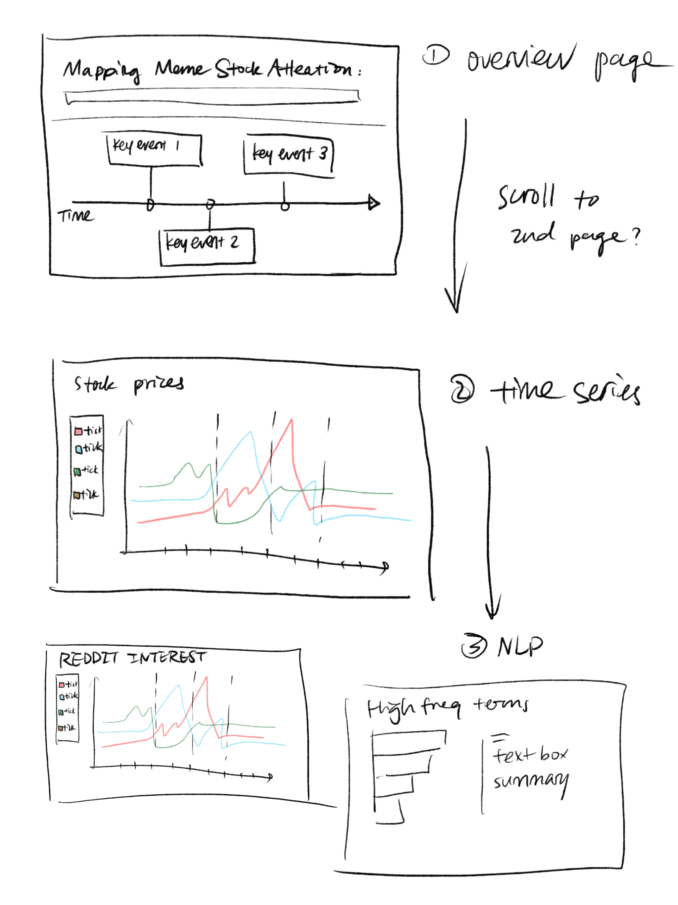
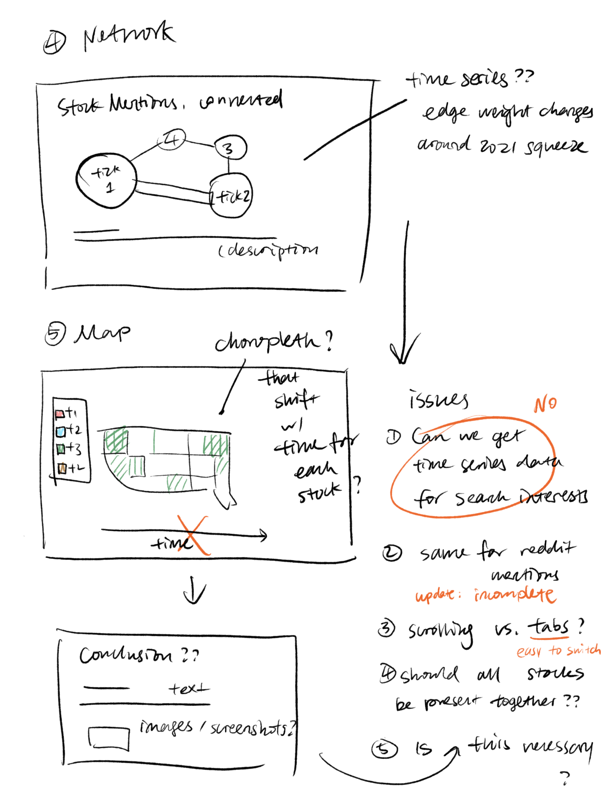
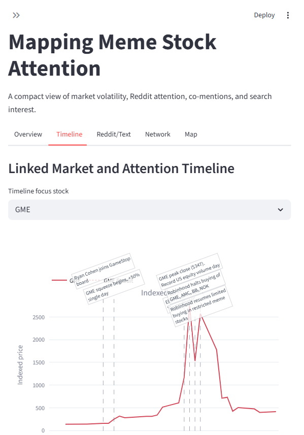
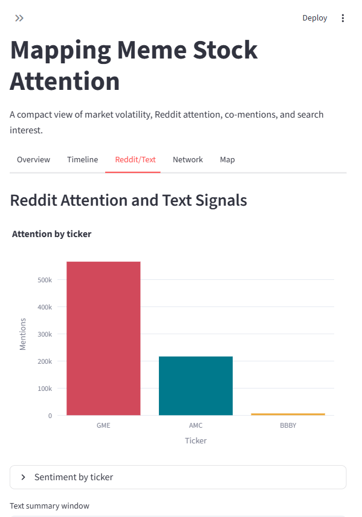
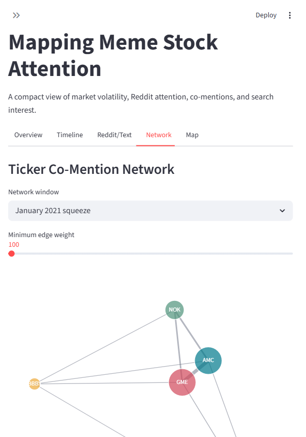
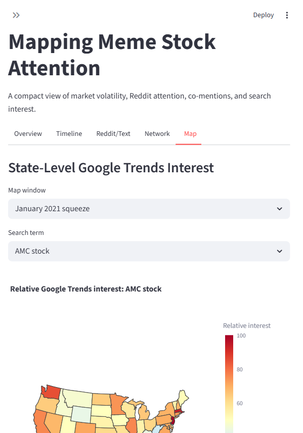
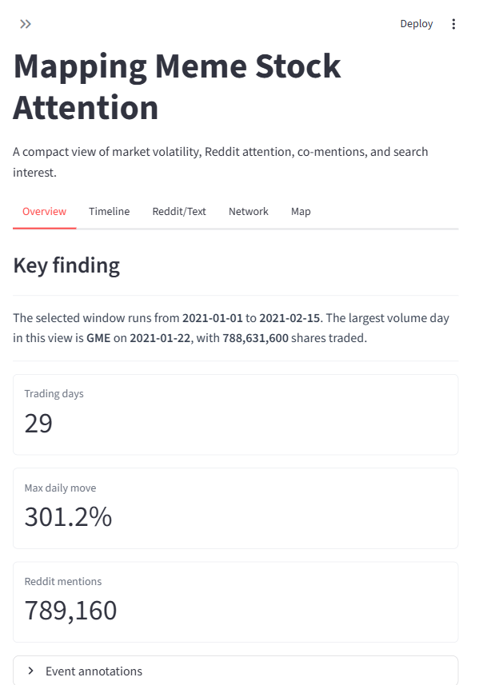

# Mapping Meme Stock Attention: Final Project Process Book

QMSS G5063 Data Visualization, Spring 2026

## Team and Submission Links

Team members:

- Ruoxi Li, UNI: rl3592, email: rl3592@columbia.edu
- Tianyu Jiang, UNI: tj2611, email: tj2611@columbia.edu
- Chunlin An, UNI: ca2965, email: ca2965@columbia.edu

Website link: https://memestockproject.streamlit.app

GitHub repository link: https://github.com/QMSS-G5063-2026/meme_stock_project

## 1. Project Overview

Our project asks how meme-stock attention moved across markets, Reddit discussion,
ticker co-mentions, and regional Google search interest during the major retail
trading events around GameStop, AMC, Bed Bath & Beyond, BlackBerry, and Nokia.
The final website is an interactive Streamlit dashboard called **Mapping Meme
Stock Attention**.

The research question is:

**How did online attention, market volatility, and regional search interest move
together during major meme-stock events?**

Our main finding is that the January 2021 squeeze is the clearest moment where
market movement, Reddit attention, and public search interest align. The data
also show that meme stocks were often discussed as a connected basket rather than
as isolated companies. GME was the most visible anchor, but AMC, NOK, BB, and
BBBY appear through co-mentions, related event windows, and search terms. The
website therefore presents meme stocks as a networked attention story, not just
as a price chart.

The final dashboard uses six pages: Overview, Timeline, Reddit/Text, Network,
Map, and Methods. This structure lets a reader move from thesis to evidence:
first the project question, then market and event timing, then Reddit text
signals, then co-mentions, then geographic search interest, and finally the data
and reproducibility notes.

## 2. Data

The project combines four data layers.

**Daily stock prices.** We used Yahoo Finance daily historical market data
through the `yfinance` Python package. The processed file is
`data/processed/market_daily.csv`. It contains daily open, high, low, close,
adjusted close, volume, daily return, volume z-score, return z-score, spike
flags, market return, and abnormal return. Abnormal return is calculated as each
stock's daily return minus the S&P 500 daily return, using `^GSPC` as the market
benchmark.

**Event timeline.** We curated major meme-stock milestones in
`data/processed/event_timeline.csv`, including Ryan Cohen joining the GameStop
board, the January 2021 GME squeeze, Robinhood trading restrictions, the AMC
June 2021 run, and later BBBY events. These events are used as annotations in
the Timeline page.

**Reddit attention, text, and network data.** We processed a local
`r/wallstreetbets` posts/comments archive into app-ready CSV files:
`reddit_daily_attention.csv`, `reddit_text_summary.csv`, and
`ticker_comention_edges.csv`. The raw archive source used for the workflow is
the Kaggle "Reddit WallStreetBets Posts and Comments" dataset:
https://www.kaggle.com/datasets/mattpodolak/rwallstreetbets-posts-and-comments.
The raw Reddit ZIP files are not committed because they are too large for normal
GitHub hosting, but the processed outputs are committed. The current processed
Reddit output contains 802,589 target-ticker mention records from 2020-12-08
through 2021-02-04.

**Google Trends state-level search interest.** We collected state-level Google
Trends interest using `pytrends` and cached raw exports in
`data/raw/google_trends/`. The processed table is
`data/processed/google_trends_state_level.csv`, with 1,020 rows across four
terms and five event windows. Google Trends values are normalized relative
interest values from 0 to 100. They are not raw search counts and are not
population-normalized search volumes.

Dataset and source links:

- yfinance / Yahoo Finance interface: https://pypi.org/project/yfinance/
- Kaggle Reddit WallStreetBets archive: https://www.kaggle.com/datasets/mattpodolak/rwallstreetbets-posts-and-comments
- Google Trends methodology: https://support.google.com/trends/answer/4365533
- pytrends package: https://pypi.org/project/pytrends/
- Processed project data in repo: https://github.com/QMSS-G5063-2026/meme_stock_project/tree/main/data/processed

Important caveats shaped the final design. Daily stock prices do not capture
intraday volatility, trading halts, or order-flow behavior. Reddit mentions are
an attention proxy, not proof of trading intent. Google Trends is normalized
relative interest, so the map should be read within a selected term and event
window rather than as exact search volume. Event annotations are curated for
storytelling context and do not prove causality.

## 3. Design Evolution and Process

The project began with a broad idea: place market movement, Reddit discussion,
Google Trends, and ticker relationships into one interactive website. Early on,
we imagined a scrolling story with one long page: first an overview timeline,
then stock prices, then Reddit interest, then a text-analysis panel, then a
network view, and finally a map.

Figure 1. Early sketch of a scrolling process-book style website, with a
timeline overview followed by stock, Reddit, and text-analysis sections.

This sketch helped clarify the narrative, but it also exposed a problem. A long
scrolling page would make it hard for users to move between related views during
a short presentation. It would also hide the current filter state. We therefore
moved toward a tabbed Streamlit dashboard with shared sidebar controls. The
final app keeps the narrative order from the sketch but makes each step easier
to access.

We also considered combining all stocks and metrics into a single time-series
view. That idea was visually dense and difficult to explain. The final design
keeps a shared ticker selection, but the Timeline page includes a separate focus
stock control so the presenter can explain one event window clearly.

Figure 2. Sketches and notes for the network and map pages. The notes show
several design questions we later resolved: whether to use scrolling or tabs,
whether all stocks should appear together, whether search-interest data could be
shown as a time series, and how to avoid overcrowding the map.

The network sketch originally asked whether edge weights should change over
time. We kept that idea conceptually but simplified it into event-window
selection and edge-weight filtering. This made the network page more reliable
and easier to understand. The map sketch asked whether Google search interest
could be shown as time-series data. Because Google Trends state-level values are
normalized by query and export window, the final map uses a choropleth and a
top-states table instead of pretending that the values are raw comparable time
series.

A major process decision was to make the Streamlit website the center of the
project rather than leaving analysis scattered across notebooks. The final site
does not try to show every intermediate calculation. Instead, it turns the
analysis into a guided set of visual arguments.

## 4. Visualization Choices

The final app uses four major evidence views.

**Timeline.** The Timeline page links stock price movement, trading volume,
event annotations, and Reddit attention. This is the core view because the
project question depends on timing. The chart uses consistent ticker colors,
direct event labels, and Plotly hover details. We added a detailed stock view
with OHLC, cumulative return, daily return, and volume/spike charts so that a
selected event window can be examined without forcing the main timeline to carry
too much detail.

Figure 3. Final Timeline page, with market movement, event labels, and attention
context organized around a selected focus stock.

**Reddit/Text.** The Reddit/Text page uses mention counts, sentiment summaries,
and top terms. We deliberately chose interpretable text summaries instead of
making BERTopic a required feature. The data are noisy social-media text, so
simple counts and top terms are easier to audit and explain. The page separates
post mentions, comment mentions, sentiment, and terms to keep the text evidence
transparent.

Figure 4. Final Reddit/Text page, showing attention and text signals from the
processed WallStreetBets archive.

**Network.** The Network page shows ticker co-mentions. Nodes are stocks and
edges are co-mention counts from posts or comments that mention multiple target
tickers. This view supports the finding that meme-stock discussion often treated
the stocks as a connected basket. The strongest-pair caption and co-mention
table give the user a textual reading of the network, which helps avoid relying
only on node position.

Figure 5. Final Network page, using ticker co-mentions to show which stocks were
discussed together.

**Map.** The Map page uses a U.S. state choropleth for Google Trends interest.
The visual question is geographic: where was search interest relatively higher
for a selected term and event window? The map uses Plotly's built-in U.S.
state rendering from two-letter state codes. This avoided a fragile shapefile
join and kept deployment reliable. A top-states table appears below the map so
users can read exact values and not depend entirely on color.

Figure 6. Final Map page, showing state-level Google Trends relative interest
with a table for exact values.

## 5. Interactivity Choices

The main interaction design is a shared left sidebar. Users can select event
windows, tickers, date ranges, and the market metric for the timeline. Keeping
these controls in one location makes the app more predictable: a user changes
the sidebar once and sees the selected evidence update across pages.

We originally considered click-to-highlight interactions in charts. We removed
that idea because hidden chart state can confuse users in Streamlit, especially
after reruns. Explicit sidebar controls are easier to teach, easier to debug,
and better for a live demo.

The Timeline page adds a separate focus-stock selector. This was a compromise
between showing all selected tickers and telling a clear story. The sidebar can
still support multi-stock context, but the detailed timeline evidence can focus
on one stock at a time.

The Network page includes an edge-weight filter so the graph can be simplified
without removing the full co-mention table. The Map page includes a search-term
selector and event-window selector. These interactions each answer a specific
question: which tickers were linked together, and where did a selected search
term have relatively higher interest?

We also simplified the interface to reduce cognitive load. We removed the idea
of a single all-in-one chart, avoided unnecessary separate pages, and kept
methods and caveats in the Methods tab instead of scattering long notes across
every visualization.

## 6. Storytelling and Structure

The website narrative is organized around one main point per page.

- Overview introduces the thesis and the available data layers.
- Timeline asks when the market movement and attention spikes happened.
- Reddit/Text asks what people were discussing and which tickers drew attention.
- Network asks which meme stocks were discussed together.
- Map asks where search interest was relatively stronger.
- Methods explains sources, caveats, and reproducibility.

Figure 7. Final Overview page, which frames the project thesis before users move
into the evidence pages.

The landing-page thesis is that price movement alone is not enough to understand
meme-stock events. The sidebar and tab order guide the reader from market timing
to online attention, then to network and geography. This order matters because
the website is meant to be explored but still has a clear narrative arc.

## 7. Polish Checklist Reflection

**Content.** The final app uses descriptive tab names, chart captions, direct
event labels, data-status notes, and source explanations. The Methods tab
summarizes expected processed files and data limitations. The Timeline caption
states that daily stock prices were pulled from Yahoo Finance and processed for
the app.

**Design.** The final layout uses a wide Streamlit page, a shared sidebar, and a
consistent tab order. Ticker colors are fixed across charts: GME is red, AMC is
teal, BBBY is gold, BB is blue-gray, and NOK is green. This prevents a ticker
from changing color when filters change.

**Accessibility.** The app does not rely only on color. It includes captions,
tables, hover labels, event text, and top-state rankings. The map includes a
table because choropleth color differences alone can be hard to read precisely.
The fixed ticker colors and text labels also reduce interpretation errors.

**Technical quality.** The app is deployed at
https://memestockproject.streamlit.app. The repository includes
`requirements.txt`, committed processed CSVs, and a Methods tab that reports
data status. The CSV loader uses file fingerprints so Streamlit cache refreshes
when processed source text changes.

**Storytelling.** The final site avoids unnecessary charts and keeps the main
question clear. Each tab has a distinct role. The story moves from a broad
claim to concrete evidence, then ends with limitations.

## 8. Feedback and Final Changes

We received two important pieces of feedback.

First, classmates said it would be easier to read the dashboard if each company
kept the same color regardless of which filters were active. We addressed this
by defining fixed ticker colors in `TICKER_COLORS` inside
`app/streamlit_app.py` and passing those colors into the Plotly timeline,
Reddit/Text charts, network nodes, and detailed stock charts. This makes the
visual language stable across pages.

Second, users asked whether Google Trends values were normalized by population.
This was an important interpretive issue. We clarified the app caption and
report language: Google Trends reports normalized relative interest, not
population-adjusted or raw search counts. The final Map page now states that
values are scaled against total Google searches in the selected geography and
export window. We also added a top-states table so users can inspect values
directly.

Other final changes came from our own review of presentation clarity. We added
direct event labels to the Timeline page, created a detailed stock view for the
selected event window, added a strongest-pair summary on the Network page, and
added a top-states table on the Map page. These changes made the site easier to
explain in a short presentation.

## 9. Findings and Code

The main findings are:

1. The January 2021 squeeze is the strongest window for connecting price
movement, event annotations, Reddit attention, and search interest.
2. Reddit discussion shows meme stocks as a basket, especially through strong
co-mentions between GME, AMC, and NOK.
3. Google Trends adds a geographic layer to the story, but it must be read as
relative interest rather than exact search volume.
4. The project is strongest when attention data and market data are shown
together with clear limitations.

Code and artifact references:

- Streamlit app: `app/streamlit_app.py`
- Reddit/text/network processing: `src/processing/build_reddit_outputs.py`
- Google Trends processing: `src/processing/build_google_trends_outputs.py`
- Static figure generation: `src/processing/build_static_figures.py`
- App tests: `tests/test_streamlit_app_ui.py`
- Market data: `data/processed/market_daily.csv`
- Event timeline: `data/processed/event_timeline.csv`
- Reddit attention: `data/processed/reddit_daily_attention.csv`
- Text summary: `data/processed/reddit_text_summary.csv`
- Co-mention edges: `data/processed/ticker_comention_edges.csv`
- Google Trends map data: `data/processed/google_trends_state_level.csv`

## 10. Challenges, Limitations, and Next Steps

The largest limitation is uneven coverage across data sources. Market data cover
a long period from 2019 through mid-2023, while the processed Reddit archive is
concentrated around 2020-12-08 to 2021-02-04. That means the Reddit/Text and
Network evidence is strongest for the January 2021 squeeze and weaker for later
AMC and BBBY event windows.

The second limitation is measurement. Reddit mentions are a proxy for attention,
not investment behavior. Google Trends shows relative search interest, not raw
search counts and not population-normalized attention. Daily market data miss
intraday volatility and trading restrictions. Event annotations help orient the
reader but do not establish causal effects.

The biggest technical challenge was balancing ambition with reliability. The
course prompt encouraged specialized visualization types, and we included text,
network, and geospatial views. But we kept the implementation grounded in
processed CSV outputs, Plotly charts, NetworkX, and cached Google Trends exports
so the deployed site would load reliably.

If we extended the project, the first improvement would be broader Reddit
coverage beyond February 2021 so later AMC and BBBY events could be analyzed
with the same social-media depth as the January 2021 squeeze. A second
improvement would be a stronger treatment of intraday market data and trading
halt events. A third improvement would be additional accessibility checks with
external users, especially for color contrast and mobile layout.
